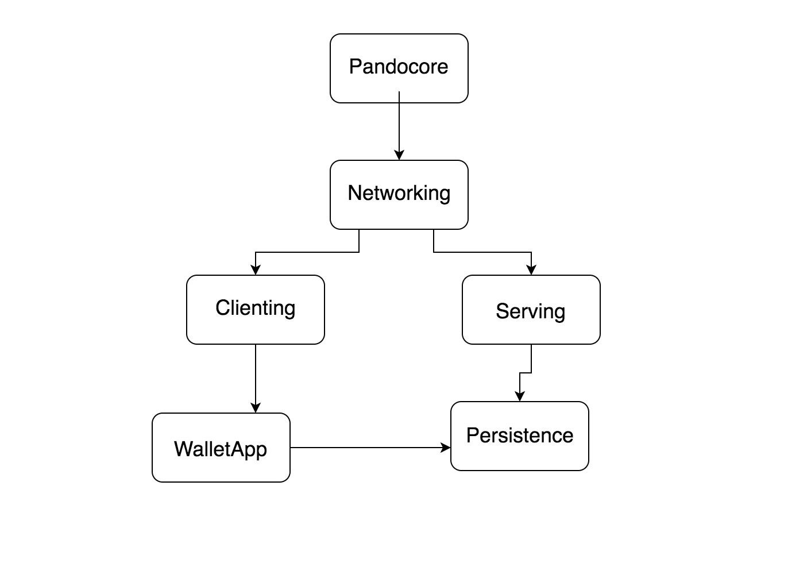

# Pando

Truly decentralized cryptocurrency.  Written in Kotlin.

Here is an [abstract about Pando](doc/abstract.md).

###Dependency Graph

## Pandocore

Pandocore is where all of Pando's blockchain, block, transaction, and address creation, and hashing functions are defined.

## Networking

**WIP**

## Clienting

Clienting has the client facing functions for interacting with the Pando server.

##Serving

Serving defines routes and in initializes the Pando server. There are two sets of tests in the src folder. One runs without persistence and just passes data in memory. The other utilizes the your database of choice as defined in the config file.

## WalletApp

WalletApp is a client facing JavaFX application for creating addresses, sending transactions, and viewing balances.

### Starting the Wallet App

1. Run the main function in Server.kt
2. Run the main function in App.kt

##Persistance

Persistence contains all of the database logic and can handle initializing both a Postgres database for the Pando server and a SQLite database for the Wallet App.

##Jsoning

Jsoning is where all of our json	parsing and json converting functions are.

## Dev environment configuration and tips

- Make sure you have version 10 of the Java JDK installed and point IDEA to they proper JDK version.
  - http://www.oracle.com/technetwork/java/javase/downloads/jdk10-downloads-4416644.html
- Use the "Import Project" option the first time you open Pando. 
- Install the Spek plugin so you can run the tests from IDEA.
- If you cannot see the Kotlin folders inside of the main and test directories right click on the Project tab in the upper left hand corner and uncheck "Hide Empty Middle Packages".